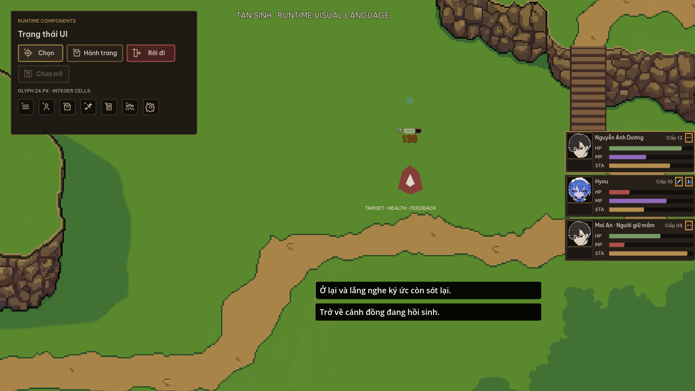
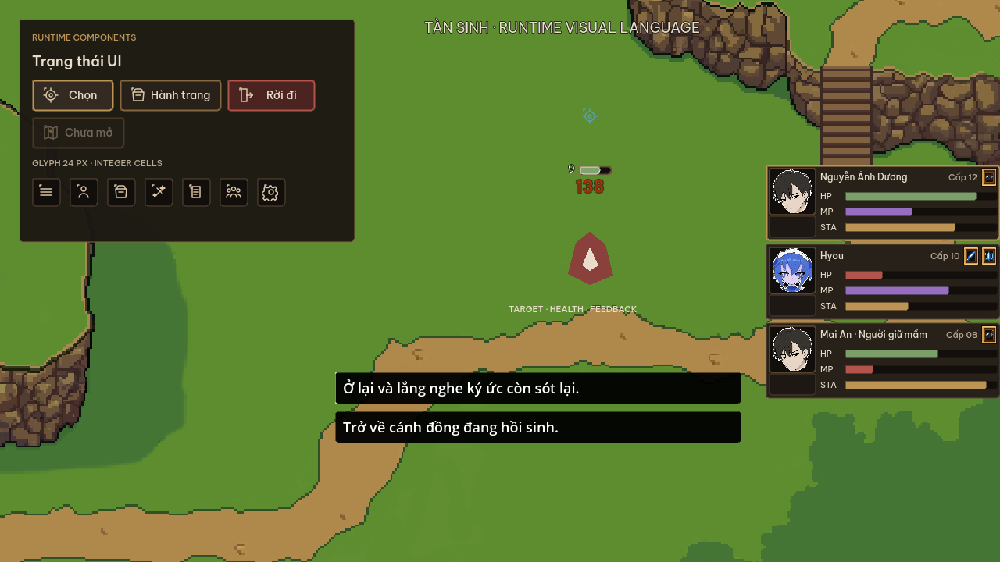
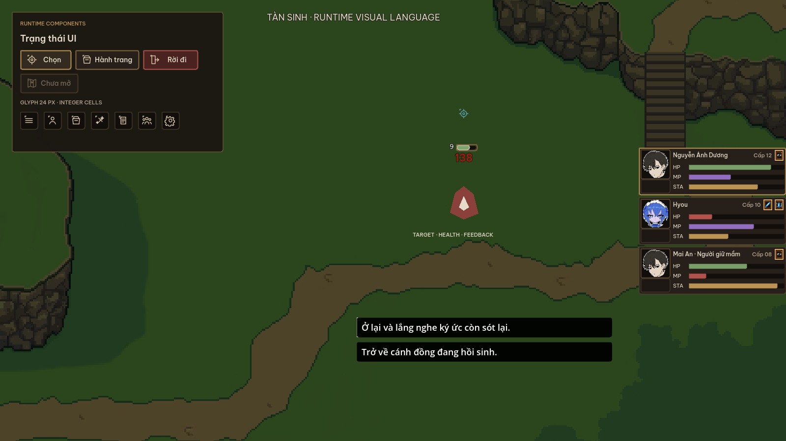
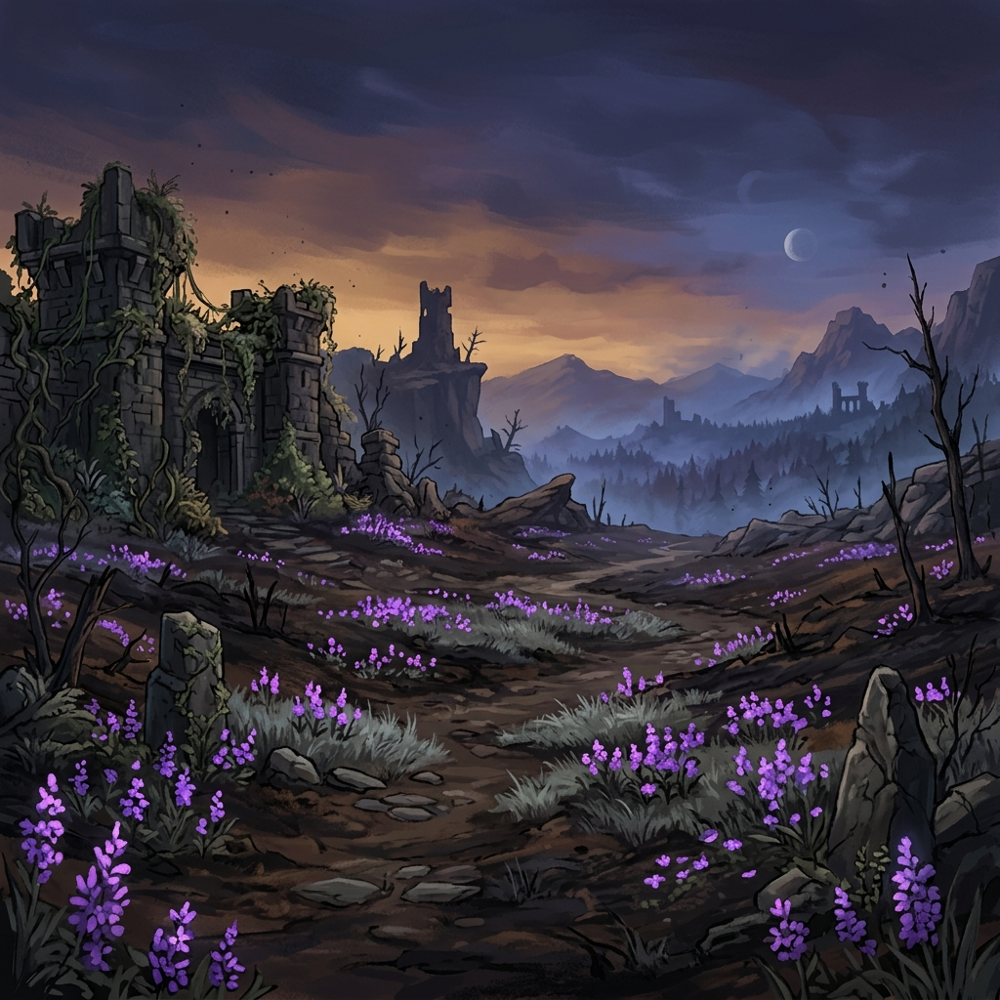

# Tàn Sinh - Visual Language UI/HUD

> [!IMPORTANT]
> **Tên game không phải styling prompt.** “Tàn” là lớp nghĩa cốt truyện;
> “Sinh”, vẻ đẹp, độ trong và sức sống mới là tín hiệu thị giác chủ đạo.
> Không được suy diễn màu nâu/xám, gỉ sét, tro bụi, vết nứt, grunge hoặc vẻ
> tàn tạ chỉ từ tên `Tàn Sinh` hay `Ashes of a Dying World`. Map và UI được
> phép sáng, sạch, rực rỡ và đẹp đẽ. Dấu vết suy tàn chỉ xuất hiện khi một
> địa điểm, vật thể, diễn biến hoặc trạng thái gameplay cụ thể biện minh cho nó.

**Phiên bản:** 1.0
**Phạm vi:** UI, HUD, icon, typography, combat feedback và VFX telegraph
**Bản xem trực quan:** [visual_language.html](visual_language.html)

> **Luận đề:** Thế giới vẫn đẹp, xanh và sống động trong khi phần cốt lõi bên dưới đang dần tàn đi.

Ba ảnh trên được capture trực tiếp từ scene validation ở `1600x900` ban ngày, `1280x720` ban ngày và `1600x900` ban đêm. Grade đêm chỉ dùng để kiểm tra tương phản; nó không phải chỉ thị biến map thành cảnh hoang tàn.

## 1. Ba trụ cột

### Sống ở bề mặt

Map không phải lúc nào cũng hoang tàn. Cảnh có thể xanh, sáng và bão hòa; đồng cỏ có thể xanh gắt, hoa có thể rực, nước và phép thuật có thể sáng. Không phủ filter xám/nâu lên toàn game chỉ để minh họa chữ “Tàn”.

### Tàn trong cấu trúc

Dấu hiệu suy tàn nằm ở vật liệu lì, đồng xỉn, khoảng tối, cạnh xói nhẹ, trạng thái mất màu và nhịp chuyển động tắt dần. Mỗi dấu hiệu chỉ xuất hiện khi có chức năng hoặc ý nghĩa kể chuyện.

### Hy vọng có trọng lượng

Ánh vàng sáng, trắng ấm và màu sống chỉ dành cho focus, lựa chọn, hồi phục, ký ức hoặc khoảnh khắc người chơi giành lại quyền kiểm soát. Không dùng glow làm trang trí thường trực.

## 2. Nguyên tắc nhận diện

- **Tương phản, không đồng màu:** cảnh sống động đi cùng chrome tối, ít bão hòa.
- **Phẳng và có cấu trúc:** bề mặt matte, viền mảnh, hình học rõ; không vàng bóng, gỗ chạm hoặc fantasy ornament.
- **Thông tin trước trang trí:** silhouette, value và trạng thái phải đọc được trước texture.
- **Một hệ glyph:** navigation và stat dùng atlas `24 px`, nét `1-2 px`; màu đến từ state của component.
- **Tiếng Việt là mặc định:** mọi label thật phải được kiểm tra dấu, wrap và độ dài.
- **Không dựa vào màu đơn độc:** resource, status và rarity luôn có thêm chữ, icon hoặc hình dạng.

## 3. Bảng màu chuẩn

| Token | Hex | Vai trò |
| --- | --- | --- |
| Canvas | `#120F0C` | Nền sâu, scrim |
| Background | `#1D1813` | Nền panel chính |
| Surface | `#29221B` | Control và hàng dữ liệu |
| Surface Raised | `#352C22` | Hover, pressed, vùng nổi |
| Border | `#5C4B38` | Viền mặc định `1 px` |
| Border Strong | `#8A6B42` | Viền nhấn, cấu trúc cấp hai |
| Accent | `#C39A57` | Focus, selection, tiến trình quan trọng |
| Text Primary | `#F0E5D2` | Nội dung chính |
| Text Secondary | `#BFAF98` | Mô tả và metadata |
| Text Disabled | `#756B5D` | Disabled, thông tin không khả dụng |
| Danger | `#B9574F` | HP thấp, lỗi, hành động nguy hiểm |
| Life | `#7FA56D` | HP, hồi phục, sinh lực |
| Memory | `#9A72C7` | MP, ký ức, năng lượng tinh thần |
| Ice | `#62B8D9` | Băng/Hyou, target clear-shot; không dùng làm stamina chung |

### Quy tắc sử dụng màu

- Neutral chiếm phần lớn diện tích UI. Semantic color chỉ xuất hiện ở dữ liệu hoặc trạng thái liên quan.
- Accent vàng dùng tối đa ở một hành động chính hoặc một focus path trong cùng cụm.
- Danger không dùng cho nút thường.
- Map sống có thể bão hòa cao. UI tự tạo nền đọc bằng scrim/panel; không ép map mất màu.
- Text nhỏ trên Background phải đạt contrast tối thiểu `4.5:1`.

## 4. Typography

Font duy nhất là **Be Vietnam Pro**, được bundle trong `assets/fonts/`:

| Vai trò | Face | Cỡ chuẩn |
| --- | --- | --- |
| Screen title | SemiBold | `24 px` |
| Section title | SemiBold | `18 px` |
| Body | Regular | `14 px` |
| Label | Medium | `12 px` |
| Micro | Medium | `11 px` |
| Combat number | SemiBold | `20 px` |
| Narrative emphasis | Italic / SemiBold Italic | Theo cỡ body |

Quy tắc:

- Letter spacing bằng `0`; không ép tracking âm.
- Không dùng all-caps cho câu dài. All-caps chỉ dành cho micro label ngắn.
- Không scale font theo viewport. Layout thay đổi trước, font chỉ đổi theo role.
- Button không cắt chữ; cho text wrap hoặc tăng chiều rộng theo nội dung.
- Không dùng Cinzel, IM Fell English hoặc font tải từ mạng.

## 5. Shape language

### Silhouette

- Panel và button là khối chữ nhật ổn định, bán kính góc `3 px`.
- Viền mặc định `1 px`; focus/selected `2 px` và giữ nguyên kích thước ngoài.
- Một đường cạnh đứt, notch nhỏ hoặc vết mòn mảnh có thể dùng cho trạng thái “tàn”, nhưng không lặp trên mọi cạnh.
- Command, category và status phải có silhouette khác nhau khi nhìn ở grayscale.

### Không dùng

- Khung vàng nhiều tầng, đinh tán giả và gỗ chạm.
- Gradient bóng kiểu mobile fantasy.
- Góc bo lớn, pill cho mọi control.
- Glow trắng dày hoặc selection outline vượt `2 px`.
- Texture sinh ở độ phân giải lớn rồi thu nhỏ về icon.

## 6. Material language

| Vật liệu | Cách biểu hiện | Dùng ở đâu |
| --- | --- | --- |
| Than lì | Màu tối phẳng, noise rất nhẹ nếu cần | Canvas, scrim, panel |
| Đồng xỉn | Viền nâu-vàng ít bão hòa, không specular | Focus, divider, selected |
| Tro | Mất màu và giảm contrast có kiểm soát | Disabled, depleted, unavailable |
| Sự sống | Màu tự nhiên rõ, không phủ nâu | Map, hồi phục, HP |
| Ký ức | Tím trầm, hình học ổn định | MP, lore state |
| Băng | Cyan lạnh, cạnh sắc và chuyển động gãy | Hyou/ice/status liên quan |

Texture chỉ bổ sung chất liệu ở kích thước đọc được. Nếu bỏ texture mà component không còn rõ chức năng, cấu trúc component đang sai.

## 7. Grid, density và asset

- Base grid: `4 px`.
- Spacing: `4 / 8 / 12 / 16 / 24 / 32 px`.
- Icon: `16 / 20 / 24 / 32 px`; navigation chuẩn `24 px`.
- Status icon: `24 px`, frame `28 px`.
- Button height: compact `32 px`, regular `40 px`, primary `48 px`.
- Party unit HUD: `300 x 97 px`, status space được reserve để không shift layout.
- Pixel art dùng nearest filtering và đặt ở integer coordinates.
- Atlas cell phải nguyên pixel, không crop số lẻ, không chứa rác giữa các cell.
- Outline asset UI: `1 px` ở `24 px`; tối đa `2 px` cho focus hoặc silhouette quan trọng.

## 8. Value hierarchy

Thứ tự ưu tiên trong combat:

1. Telegraph sắp gây nguy hiểm hoặc cửa sổ phản ứng.
2. Actor, target marker và hit confirmation.
3. HP/resource/status ảnh hưởng quyết định hiện tại.
4. Damage number và progression tạm thời.
5. Quest tracker, hint và thông tin nền.

Quy tắc value:

- Telegraph active là vùng sáng nhất quanh actor, nhưng chỉ trong thời gian active.
- HUD persistent tối và ổn định; không tranh sáng với gameplay.
- Damage number không che target marker hoặc enemy HP.
- Khi nhiều overlay cùng xuất hiện, dùng lane cố định: **Target → Health → Feedback → Progression**.
- Low-resource tăng tương phản và đổi hình/nhãn, không chỉ đổi hue.

## 9. Foreground và background

### Background thế giới

- Có thể xanh, sáng và bão hòa; không cần “map tàn”.
- Chi tiết tần số cao tránh nằm ngay dưới text persistent nếu có thể.
- Không blur toàn cảnh để làm UI đọc được. Dùng scrim cục bộ ở UI.

### Gameplay foreground

- Actor và telegraph giữ silhouette sạch trước địa hình.
- VFX không dùng cùng value/hue với nền trực tiếp bên dưới nếu làm mất hitbox.
- Foreground foliage có thể che chân actor nhưng không che target marker, enemy HP hoặc prompt tương tác.

### UI foreground

- Panel dùng nền tối có alpha đủ đọc trên cả cảnh sáng lẫn tối.
- Tooltip là control nhận input; node có tooltip không đặt `MouseFilter.Ignore`.
- Không xếp card trong card. Chỉ frame các item lặp, modal và công cụ thật sự độc lập.

## 10. Component rules

### Party HUD

- Neo bên phải.
- Portrait là layer độc lập; tài liệu này không thay đổi artwork nhân vật.
- Name, level, HP, MP, stamina và status là node riêng.
- HP/MP/stamina có chữ hoặc glyph khác nhau; stamina dùng neutral/accent, không dùng Ice chung.
- Selected character dùng border Accent `2 px`, không glow trắng dày.
- Status strip có chiều cao reserve; bật/tắt status không đẩy các unit khác.

### Enemy và world HUD

- Enemy HP là native trough/fill/frame, có level và vùng status riêng.
- Boss/elite cần variant hình học có chủ đích, không chỉ scale thanh thường.
- Target marker, HP, damage và XP dùng lane chung; không hard-code từng service vào cùng một điểm.
- Marker blocked/clear-shot phải khác cả màu lẫn hình/nhãn.

### Main screen và game menu

- Cảnh thế giới thật là tín hiệu đầu tiên; chrome tối tạo đối lập.
- Primary action là `Tiếp tục` khi có save, `Bắt đầu` khi chưa có save.
- `Trò chơi mới` chỉ hiện khi có save và không tự xóa save.
- Menu trong game chỉ hiển thị feature đang hoạt động: Nhân vật, Kho đồ, Kỹ năng, Nhiệm vụ, Đội, Cài đặt.
- Mỗi feature dùng glyph riêng; Map/Thành tựu không xuất hiện khi chưa có nội dung.

### Panels

- Inventory, Character, Party, Quest, Skill và Settings dùng chung chrome, title scale và footer rhythm.
- Tab theo nội dung, cho scroll ngang khi thiếu chỗ; không ép text co nhỏ.
- Empty state phản ánh dữ liệu thật, không dùng số dư, tên hoặc item giả.
- Option, slider, toggle và key binding đều phải nhận keyboard/gamepad focus.

### Dialog

- Choice width responsive `360-520 px`; text Việt dài wrap, không trim.
- Vùng choice overflow scroll; focus cuối phải tự cuộn vào view.
- Một hoặc hai choice bám gần textbox, không nằm ở đỉnh một vùng scroll rỗng.
- Focus có outline đầy đủ tối đa `2 px` và khác hover.

## 11. VFX và telegraph

### Startup

- Hiện silhouette vùng ảnh hưởng trước chi tiết hạt.
- Dùng nhịp tăng opacity/scale đều; không rung ngẫu nhiên.
- Telegraph nguy hiểm có pattern hoặc cạnh riêng, không chỉ đổi đỏ.

### Active

- Peak sáng ngắn tại thời điểm hit.
- Core/hitbox đọc rõ hơn trail và particle.
- Hit-stop không làm UI đổi kích thước; camera shake tôn lực nhưng không che input cue.

### Recovery

- Hướng chuyển động rời khỏi điểm va chạm hoặc tan theo vector hành động.
- Giảm saturation/opacity trước khi biến mất.
- Phần recovery không tiếp tục trông như hitbox đang active.

### Motion tokens

- Hover/focus: `80-120 ms`.
- Panel enter/exit: `140-220 ms`.
- Combat feedback: theo timing gameplay; visual tail không thay đổi frame gây damage.
- Tôn trọng tùy chọn giảm screen shake, hit-stop và damage number.

## 12. Accessibility

- Text thường đạt contrast `4.5:1`; text lớn tối thiểu `3:1`.
- Focus keyboard/gamepad luôn nhìn thấy và có thứ tự hợp lý.
- Màu semantic luôn có fallback hình dạng:

| Semantic | Màu | Fallback hình dạng/chữ |
| --- | --- | --- |
| HP/Life | Xanh lá / đỏ khi nguy cấp | Nhãn `HP`, đầu bar vuông |
| MP/Memory | Tím | Nhãn `MP`, glyph kim cương |
| Stamina | Vàng đồng | Nhãn `STA`, bar phân đoạn |
| Ice/Frozen | Cyan | Tinh thể/cạnh sắc |
| Danger | Đỏ đất | Tam giác/cảnh báo + copy |
| Selected | Accent | Border `2 px` + focus cursor |

- Tooltip phải hover/focus được.
- Test tên tiếng Việt dài, dấu kết hợp, UI scale lớn và `1280x720`/`1600x900`.
- Animation không được làm layout shift.

## 13. Do / Don't

| Do | Don't |
| --- | --- |
| Giữ map sống động, dùng UI tối để tương phản | Desaturate toàn bộ map vì tên game |
| Dùng native style và token | Thu nhỏ asset AI/render lớn thành button/icon |
| Một glyph cho một semantic | Tái dùng icon Character cho Party |
| Reserve không gian cho status | Để status đẩy unit HUD kế tiếp |
| Dùng focus outline ổn định | Đổi kích thước button khi hover/focus |
| Hiện empty state thật | Chèn item, tiền hoặc nhân vật giả |
| Cho text Việt wrap | Cắt chữ hoặc fallback font từng ký tự |
| Kiểm tra bằng runtime capture | Dùng mock tĩnh làm bằng chứng duy nhất |

## 14. Checklist production

Trước khi merge một UI/VFX mới:

- [ ] Dùng token chung; không thêm màu gần giống nếu chưa có semantic mới.
- [ ] Font lấy từ `assets/fonts/`, không tải mạng.
- [ ] Icon ở cell nguyên `24 px`, outline `1-2 px`.
- [ ] Normal, hover, focus, pressed, disabled giữ cùng geometry.
- [ ] Keyboard/gamepad đi qua toàn bộ control.
- [ ] Text Việt dài không tràn/cắt.
- [ ] Tooltip nhận input.
- [ ] Không có dữ liệu giả trong runtime state.
- [ ] Overlay không chồng lane.
- [ ] Capture `1600x900` và `1280x720` trên cảnh sáng và tối.
- [ ] Reference scan sạch trước khi xóa asset legacy.

## 15. Reference hình ảnh

Concept trên là một ví dụ cho đối lập sống/tàn, không phải yêu cầu mọi map phải thành phế tích. Cảnh đồng cỏ, thành phố, hang động hoặc vùng băng vẫn giữ màu sắc và bản sắc riêng.

Portrait Hikaru và Hyou nằm ngoài phạm vi chuẩn hóa này; pipeline UI chỉ quy định crop, kích thước vùng hiển thị và interaction, không chỉnh artwork.
